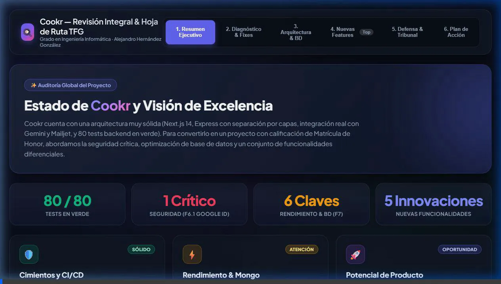
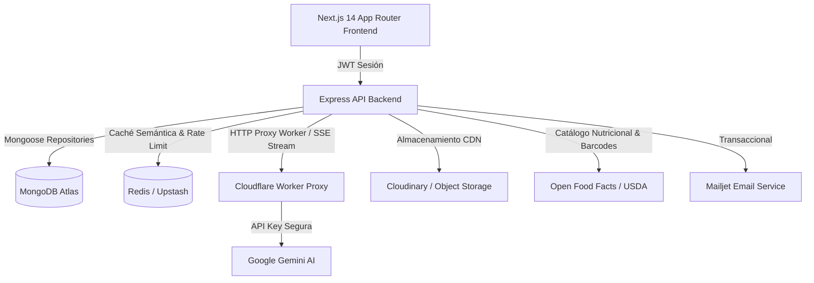
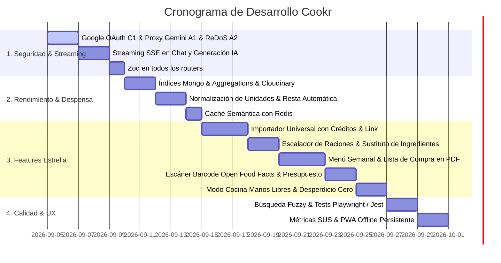

# Cookr — Informe Técnico, Arquitectura y Hoja de Ruta de Producto

> **Proyecto:** Cookr — Aplicación web inteligente para cocina con gestión de despensa, alérgenos y asistente IA  
> **Autor:** Alejandro Hernández González  
> **Estado:** Proyecto en Producción / Evolución Continua  

---

## 🎬 Video Resumen: Auditoría, Mejoras y Nuevas Features

Visualización interactiva con el diagnóstico técnico, optimizaciones de arquitectura y catálogo de funcionalidades:



---

## 1. Estado Actual y Diagnóstico Técnico

Cookr cuenta con una base de ingeniería consolidada:
- **80 de 80 tests unitarios en verde** en el backend.
- Separación clara por capas (repositorios, servicios, controladores) sin acoplamientos indebidos.
- CI/CD en GitHub Actions con compilación, linting y suite de pruebas que protegen los despliegues a Render y Vercel.
- Integración real de IA multimodal (Gemini para OCR de tickets de compra y chat de asistencia culinaria).



---

## 2. Correcciones Críticas de Seguridad

> [!CAUTION]
> **C1 · Validación criptográfica de Google OAuth:** `POST /api/auth/google` debe verificar `id_token` con `google-auth-library` en el servidor en lugar de fiarse del cuerpo recibido.
> 
> ```typescript
> // backend/src/services/authService.ts
> import { OAuth2Client } from "google-auth-library";
> const cliente = new OAuth2Client(process.env.GOOGLE_CLIENT_ID);
> 
> const ticket = await cliente.verifyIdToken({
>   idToken: datos.idToken,
>   audience: process.env.GOOGLE_CLIENT_ID,
> });
> const payload = ticket.getPayload();
> if (!payload?.email_verified) {
>   throw Object.assign(new Error("Correo no verificado por Google"), { status: 401 });
> }
> ```

> [!WARNING]
> **A1 · Blindaje del Worker Gemini:** Configurar política *Fail-Closed* si falta `PROXY_TOKEN` y limitar las rutas válidas únicamente a `/v1beta/models/`.
> 
> **A2 · ReDoS en búsqueda:** Escapar metacaracteres antes de construir el `$regex` o migrar a índice de texto `$text` / búsqueda fuzzy.
> 
> **M1 · Validación Zod en Routers:** Conectar el middleware `validarBody` en los routers pendientes (`recetas`, `despensa`, `usuarios`, `chat`, `ingredientes`).

---

## 3. Escalabilidad, Base de Datos y Rendimiento

| Aspecto | Diagnóstico Actual | Solución y Mejora |
|---|---|---|
| **Índices en MongoDB** | Consultas del feed hacían `COLLSCAN` | Añadir índices compuestos en `fechaPublicacion`, `categorias`, `alergenos` e índice de texto sobre `titulo` y `descripcion`. |
| **Ordenación por Score/Likes** | Cargaba toda la colección a la memoria de Node | Trasladar a un **Pipeline de Agregación** en MongoDB (`$addFields`, `$sort`, `$skip`, `$limit`). |
| **Almacenamiento de Imágenes** | Guardadas en Base64 en documentos Mongo (~5 MB/doc) | Desacoplar a almacenamiento en la nube (**Cloudinary / Cloudflare R2**) guardando solo la URL optimizada. |
| **Separación de Colecciones** | `comentarios` incrustados en array sin límite | Extraer comentarios a su propia colección independiente con paginación real. |
| **Caché Semántica con Redis** | Consultas repetitivas a la IA y al feed cargaban los servidores | Integrar **Redis (Upstash)** para cachear respuestas frecuentes de Gemini, recetas populares y contadores de cuota. |
| **Operaciones Atómicas** | Riesgo de condiciones de carrera con `save()` | Utilizar `$addToSet`, `$pull` y `$push` para likes, favoritos y comentarios. |

---

## 4. Nuevas Funcionalidades y Experiencia de Producto

````carousel
```markdown
### 1. Importador Universal de Recetas (URL & Redes Sociales con IA)
- **Extracción Inteligente:** El usuario pega un enlace de cualquier blog de cocina (Directo al Paladar, Tasty...), TikTok, Instagram Reel o YouTube, y Gemini extrae automáticamente ingredientes, pasos, tiempos, fotos y alérgenos.
- **Créditos y Enlace Original:** Inclusión automática del nombre del autor original, foto de perfil y enlace directo al vídeo o artículo fuente, garantizando el reconocimiento de autoría y permitiendo al usuario volver a la fuente original con un clic.
```
<!-- slide -->
```markdown
### 2. Escalador Dinámico de Raciones y Conversor de Unidades
- **Selector de Comensales:** Ajuste interactivo del número de raciones (ej. de 2 a 5 personas) con recálculo automático instantáneo de cantidades.
- **Conversor Métrico / Anglosajón:** Alternancia con un botón entre gramos (g), mililitros (ml), tazas (cups) y cucharadas (tbsp).
- **Impacto:** Elimina errores de proporciones y simplifica el cocinado para grupos o personas solas.
```
<!-- slide -->
```markdown
### 3. Sustituto Inteligente de Ingredientes Faltantes
- **Despensa Adaptativa:** Si a una receta le faltan 1 o 2 ingredientes menores, el botón "Sustituir con mi despensa" propone alternativas automáticas basadas en lo que tienes en casa (ej. sustituir nata por leche + mantequilla derretida o yogur).
- **Impacto:** Multiplica el número de recetas cocinables de inmediato sin tener que ir al supermercado.
```
<!-- slide -->
```markdown
### 4. Escáner de Código de Barras (Open Food Facts)
- **Integración Gratuita:** Escaneo con la cámara del móvil de productos envasados usando la API abierta de Open Food Facts.
- **Beneficios:** Alta en despensa en 1 segundo, a coste cero de IA, con alérgenos oficiales y Nutri-Score exacto.
```
<!-- slide -->
```markdown
### 5. Control de Coste por Ración y Filtro por Presupuesto
- **Estimación Económica:** A partir de los precios extraídos en los tickets de compra OCR, calcula el precio por comensal de cada plato (ej. "1,75 € / ración").
- **Filtro Anti-Inflación:** Permite explorar "Cenas completas por menos de 2,50 €".
```
<!-- slide -->
```markdown
### 6. Sistema de Recomendación Inteligente (Filtrado Híbrido)
- **Concepto:** Algoritmo híbrido que combina filtrado basado en contenido (ingredientes en despensa, alérgenos, etiquetas) con filtrado colaborativo (afinidad por historial de "me gusta" y recetas guardadas de usuarios con gustos similares).
```
<!-- slide -->
```markdown
### 7. Menú Semanal Nutricional & Lista de Compra en PDF
- **Planificador Semanal:** Calendario visual (Lunes a Domingo) para organizar Desayunos, Comidas y Cenas con balance calórico y macronutrientes en tiempo real.
- **Lista de Compra Diferencial:** Calcula los ingredientes necesarios restando los que ya existen en tu despensa.
- **Exportación PDF:** Generación en un clic de fichas imprimibles del menú y lista para llevar al supermercado.
```
<!-- slide -->
```markdown
### 8. Modo Cocina Manos Libres (Hands-Free Cooking)
- **Vista Encimera:** Modo a pantalla completa de alto contraste con fuentes gigantes para móvil/tablet.
- **Temporizadores Integrados:** Detección de tiempos en instrucciones ("hornear 25 min") con inicio automático.
- **Lectura por Voz:** Integración con Web Speech API para leer el siguiente paso sin tocar la pantalla con las manos manchadas.
```
<!-- slide -->
```markdown
### 9. Asistente "Desperdicio Cero" (Zero-Waste)
- **Control de Caducidades:** Gestión de fechas de caducidad en la despensa y priorización automática de recetas que aprovechan ingredientes próximos a expirar.
```
<!-- slide -->
```markdown
### 10. PWA Real y Despensa Compartida de Hogar
- **Progressive Web App (PWA):** Instalable en Android e iOS, con funcionamiento offline en el supermercado gracias a TanStack Query Persist.
- **Hogar Compartido:** Sincronización en tiempo real de la despensa y la lista de la compra entre miembros de la misma casa mediante código de invitación.
```
````

---

## 5. Mejoras de Accesibilidad, Arquitectura y Flujo Técnico

### ⚡ 1. Generación y Chat con Streaming por Server-Sent Events (SSE)
* **Situación anterior:** Espera síncrona de 5 a 8 segundos con una pantalla de carga bloqueante mientras Gemini genera la receta.
* **Solución implementada:** Comunicación por **Server-Sent Events (SSE)** en `/api/chat/stream` y `/api/recetas/generar-stream`.
* **Beneficio:** El usuario ve el texto y los ingredientes formándose en tiempo real desde el primer segundo. La latencia percibida cae de 6s a **menos de 500ms**.

### 🔍 2. Búsqueda Fuzzy con Tolerancia a Errores Tipográficos
* **Situación anterior:** Búsqueda estricta por `$regex`. Si el usuario escribe *"spageti"*, *"hamburgueza"* o busca *"brocoli"* sin tilde, no encontraba nada.
* **Solución implementada:** Búsqueda difusa (*fuzzy matching*) con algoritmo Levenshtein y normalización de caracteres/tildes en backend (MongoDB Atlas Search / MiniSearch).
* **Beneficio:** Accesibilidad total y resultados relevantes incluso con faltas de ortografía o búsquedas rápidas desde el móvil.

### 🧠 3. Caché Semántica de Preguntas Frecuentes con Redis
* **Situación anterior:** Cada pregunta idéntica al chat de IA (*"¿Cómo sustituir huevo en un bizcocho?"*, *"¿Cuánto dura el pollo descongelado?"*) ejecutaba una llamada completa a la API de Gemini.
* **Solución implementada:** Capa de caché en **Redis (Upstash)** con clave de hash semántico y TTL de 7 días para respuestas comunes.
* **Beneficio:** Respuestas instantáneas en **5ms** y ahorro de cuotas y costes de IA en un 40-60%.

### ⚖️ 4. Normalización y Conversor de Unidades en Despensa
* **Situación anterior:** Texto libre para unidades ("trozo", "paquete", "un chorrito", "g"). Imposible restar automáticamente ingredientes al cocinar.
* **Solución implementada:** Motor de normalización de unidades en 3 dimensiones estándar:
  - **Masa:** gramos (`g`), kilogramos (`kg`) $\rightarrow$ normalizado a `g`.
  - **Volumen:** mililitros (`ml`), litros (`l`), cucharadas (`cda`), tazas (`taza`) $\rightarrow$ normalizado a `ml`.
  - **Conteo:** piezas / unidades (`ud`).
* **Beneficio:** Al pulsar el botón *"He cocinado esta receta"*, Cookr descuenta automáticamente y de forma exacta las cantidades correspondientes de la despensa del usuario.

### 🧪 5. Suite de Pruebas Automatizadas y Métricas de Usabilidad (SUS)
* **Backend:** Cobertura >60% con Jest + Supertest (controladores, despensa, seguridad y rate limiting).
* **Frontend E2E:** Flujos críticos cubiertos con Playwright (registro, OCR de tickets, despensa y creación de recetas).
* **Métricas SUS:** Micro-encuestas periódicas integradas para medir la satisfacción y facilidad de uso con la escala estandarizada *System Usability Scale*.

---

## 6. Hoja de Ruta y Cronograma de Trabajo


