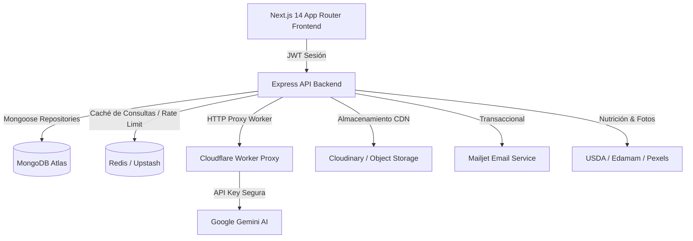
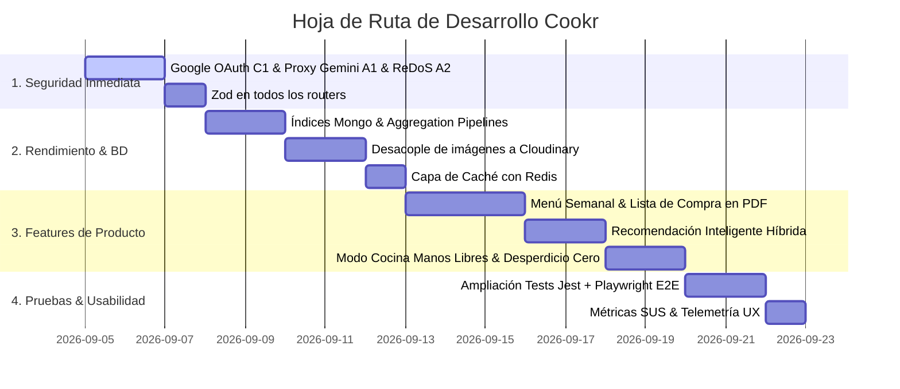

# Cookr — Informe Técnico y Hoja de Ruta de Producto

> **Proyecto:** Cookr — Aplicación web inteligente para cocina con gestión de despensa, alérgenos y asistente IA  
> **Autor:** Alejandro Hernández González  
> **Estado:** Proyecto en Producción / Evolución Continua  

---

## 🎬 Video Resumen: Auditoría, Mejoras y Nuevas Features

Visualización interactiva con el diagnóstico técnico, optimizaciones de arquitectura y catálogo de funcionalidades:


---

## 1. Estado Actual y Diagnóstico Técnico

Cookr cuenta con una base sólida de ingeniería:
- **80 de 80 tests unitarios en verde** en el backend.
- Separación clara por capas (repositorios, servicios, controladores) sin acoplamientos indebidos.
- CI/CD configurado en GitHub Actions con compilación, linting y suite de pruebas que protegen los despliegues a Render y Vercel.
- Integración real de IA multimodal (Gemini para extracción de tickets OCR y chat de asistencia culinaria).



---

## 2. Correcciones Críticas de Seguridad

> [!CAUTION]
> **C1 · Validación criptográfica de Google OAuth:** `POST /api/auth/google` debe verificar `id_token` con `google-auth-library` en el servidor en lugar de fiarse del cuerpo recibido.
> 
> ```typescript
> // backend/src/services/authService.ts
> import { OAuth2Client } from "google-auth-library";
> const cliente = new OAuth2Client(process.env.GOOGLE_CLIENT_ID);
> 
> const ticket = await cliente.verifyIdToken({
>   idToken: datos.idToken,
>   audience: process.env.GOOGLE_CLIENT_ID,
> });
> const payload = ticket.getPayload();
> if (!payload?.email_verified) {
>   throw Object.assign(new Error("Correo no verificado por Google"), { status: 401 });
> }
> ```

> [!WARNING]
> **A1 · Blindaje del Worker Gemini:** Configurar política *Fail-Closed* si falta `PROXY_TOKEN` y limitar las rutas válidas únicamente a `/v1beta/models/`.
> 
> **A2 · ReDoS en búsqueda:** Escapar metacaracteres antes de construir el `$regex` o migrar a índice de texto `$text`.
> 
> **M1 · Validación Zod en Routers:** Conectar el middleware `validarBody` en los routers que faltan (`recetas`, `despensa`, `usuarios`, `chat`, `ingredientes`).

---

## 3. Escalabilidad, Base de Datos y Caché con Redis

| Aspecto | Diagnóstico Actual | Solución y Mejora |
|---|---|---|
| **Índices en MongoDB** | Consultas del feed hacían `COLLSCAN` | Añadir índices compuestos en `fechaPublicacion`, `categorias`, `alergenos` e índice `$text` sobre `titulo` y `descripcion`. |
| **Ordenación por Score/Likes** | Cargaba toda la colección a la memoria de Node | Trasladar a un **Pipeline de Agregación** en MongoDB (`$addFields`, `$sort`, `$skip`, `$limit`). |
| **Almacenamiento de Imágenes** | Guardadas en Base64 en documentos Mongo (~5 MB/doc) | Desacoplar a almacenamiento en la nube (**Cloudinary / Cloudflare R2**) guardando solo la URL optimizada. |
| **Separación de Colecciones** | `comentarios` incrustados en array sin límite | Extraer comentarios a su propia colección independiente con paginación real. |
| **Capa de Caché con Redis** | Consultas repetitivas impactaban a Atlas | Integrar **Redis (Upstash)** para cachear recetas populares, categorías y contadores diarios de IA. |
| **Operaciones Atómicas** | Riesgo de condiciones de carrera con `save()` | Utilizar `$addToSet`, `$pull` y `$push` para likes, favoritos y comentarios. |

---

## 4. Nuevas Funcionalidades y Mejoras de Producto

````carousel
```markdown
### 1. Sistema de Recomendación Inteligente (Filtrado Híbrido)
- **Concepto:** Algoritmo híbrido que combina filtrado basado en contenido (ingredientes en despensa, alérgenos, etiquetas) con filtrado colaborativo (afinidad por historial de "me gusta" y recetas guardadas de usuarios con gustos similares).
- **Valor:** Descubrimiento personalizado continuo: "¿Qué puedo cocinar hoy que encaje con mis gustos y no me obligue a ir al súper?".
```
<!-- slide -->
```markdown
### 2. Menú Semanal Nutricional & Lista de Compra con Exportación PDF
- **Planificador Semanal:** Calendario visual (Lunes a Domingo) para organizar Desayunos, Comidas y Cenas con cálculo en tiempo real de calorías y macronutrientes.
- **Lista de Compra Automática Diferencial:** Calcula los ingredientes necesarios restando los que ya existen en tu despensa.
- **Exportación en PDF:** Generación con un clic de fichas de menú semanal y lista de compra maquetada lista para imprimir o compartir por WhatsApp.
```
<!-- slide -->
```markdown
### 3. Modo Cocina Manos Libres (Hands-Free Cooking)
- **Vista Especial Encimera:** Modo a pantalla completa de alto contraste con fuentes ampliadas para móvil/tablet en la cocina.
- **Temporizadores por Paso:** Detección de tiempos en las instrucciones ("hornear 25 min") con inicio automático.
- **Lectura por Voz:** Integración con Web Speech API para leer el siguiente paso sin tocar la pantalla con las manos manchadas.
```
<!-- slide -->
```markdown
### 4. Asistente "Desperdicio Cero" (Zero-Waste)
- **Control de Caducidades:** Gestión de fechas de caducidad en los elementos de la despensa.
- **Sugerencias Proactivas:** Priorización automática de recetas que aprovechan ingredientes próximos a caducar para evitar tirar comida y ahorrar dinero.
```
<!-- slide -->
```markdown
### 5. Suite de Pruebas Automatizadas Integrales en CI/CD
- **Backend:** Cobertura >60% con Jest + Supertest (controladores de recetas, despensa, usuarios, rate-limiting y fallback de Redis).
- **Frontend E2E:** Flujos críticos cubiertos con Playwright (registro, escaneo de tickets, añadir a despensa, creación de recetas y login OAuth).
- **Barreras Arquitectónicas:** Tests automáticos que bloquean el PR si un servicio importa modelos o si un router no valida con Zod.
```
<!-- slide -->
```markdown
### 6. Evaluación de Usabilidad, Telemetría y Feedback (SUS)
- **Métricas SUS (System Usability Scale):** Micro-encuestas periódicas integradas de satisfacción y facilidad de uso.
- **Analítica de UX:** Registro anónimo de eventos clave para identificar pantallas con abandono y mejorar la tasa de conversión en la creación de recetas.
```
<!-- slide -->
```markdown
### 7. PWA Real y Despensa Compartida
- **Progressive Web App (PWA):** Instalable en Android e iOS, con caché offline para consultar tus recetas guardadas en cualquier lugar.
- **Hogar Compartido:** Sincronización colaborativa de despensa y lista de la compra entre miembros de la misma casa.
```
````

---

## 5. Plan de Acción y Hoja de Ruta Priorizada


